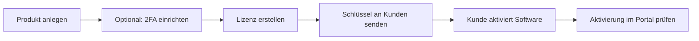
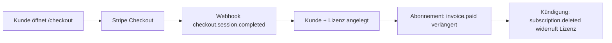

# Anleitung für Lizenz-Administratoren

Diese Anleitung beschreibt den **tatsächlichen Stand** des Byte Commander License Servers (Admin-Portal + Backend). Sie richtet sich an Personen, die Produkte, Lizenzen und Aktivierungen verwalten.

---

## 1. Voraussetzungen

| Voraussetzung | Details |
|---|---|
| Zugriff | URL des License Servers (z. B. `<ihre-server-url>`) |
| Anmeldung | BC OAuth **oder** lokaler Admin-Modus (Self-Hosting ohne OAuth) |
| Rolle | Admin-Benutzer (Owner oder `role: admin`) |

### Anmeldung (Produktion mit OAuth)

1. Admin-Portal im Browser öffnen.
2. Auf **Sign in** klicken.
3. Mit dem konfigurierten OAuth-Konto anmelden.

### Lokaler Admin-Modus (Entwicklung / Self-Hosting)

Wenn **kein OAuth** konfiguriert ist (`OAUTH_SERVER_URL` / `VITE_APP_ID` fehlen) oder `LOCAL_AUTH_ENABLED=true` gesetzt ist, authentifiziert der Server Anfragen automatisch als lokaler Admin.

Optional in `.env.local`:

```env
LOCAL_AUTH_ENABLED=true
LOCAL_AUTH_OPEN_ID=local-admin
LOCAL_AUTH_NAME=Local Admin
LOCAL_AUTH_EMAIL=admin@localhost
```

---

## 2. Navigation im Admin-Portal

| Menüpunkt | Pfad | Funktion |
|---|---|---|
| Dashboard | `/` | Kennzahlen, letzte Aktivierungen, Lizenzstatus |
| Products | `/products` | Software-Produkte verwalten (sichtbare, kopierbare **Product ID**) |
| Licenses | `/licenses` | Lizenzschlüssel erstellen und widerrufen |
| Customers | `/customers` | Kundenstammdaten (Lizenznehmer, keine Portal-Logins) |
| Activations | `/activations` | Geräte-Aktivierungen einsehen |
| Webhooks | `/webhooks` | Outbound Event-Benachrichtigungen |
| Billing | `/billing` | Stripe-Pläne und Zahlungshistorie |
| Admin Users | `/admins` | Portal-Konten (`users`: Rolle, Sperren) |

Öffentliche Checkout-Seite für Endkunden: `/checkout`

---

## 3. Standard-Workflow: Von Produkt bis Kundenlizenz



### Schritt 1: Produkt anlegen

1. **Products** → **Add Product**
2. Felder ausfüllen:
   - **Name** – z. B. `Meine Desktop-App`
   - **Description** – Kurzbeschreibung (optional)
3. **Create** klicken
4. Im Erfolgsdialog die **Product ID** kopieren (auch als Toast `Product created. ID: …`)

**Wo finde ich die Product ID?**

- Spalte **Product ID** auf **Products** (Monospace + Copy-Button)
- Nach dem Anlegen im Dialog **Product created**
- Im Edit-Dialog des Produkts
- In den Produkt-Auswahlen unter **Licenses**, **Billing** und **Activations** als `ID · Name`

Integratoren und die öffentliche API (`api.activate` / `api.validate`) verwenden diese numerische ID als `productId`. Es gibt derzeit keinen separaten Product-Slug.

### Schritt 2: 2FA einrichten (optional, empfohlen für sensible Produkte)

2FA gilt **nur für neue Geräte-Aktivierungen**, nicht für den täglichen Programmstart.

1. **Products** → beim Produkt auf das **Shield-Symbol** klicken
2. **Setup 2FA** klicken
3. QR-Code mit **Google Authenticator** (oder kompatibler TOTP-App) scannen
4. **Backup-Codes** sicher archivieren (Copy-Button)
5. **Enable requirement** klicken – ab dann ist 2FA für Neueraktivierungen Pflicht

| Status-Badge | Bedeutung |
|---|---|
| Not configured | Noch kein TOTP-Secret hinterlegt |
| Configured | Secret/QR vorhanden |
| Required for activation | 2FA ist für neue Aktivierungen aktiv |
| Optional | 2FA eingerichtet, aber nicht erzwungen |

**2FA deaktivieren:** Im gleichen Dialog **Disable requirement** (Secret bleibt gespeichert).

### Schritt 3: Kunde anlegen (optional)

1. **Customers** → **Add Customer**
2. **Email** (Pflicht), **Name**, **Company** (optional)
3. Speichern

> Kunden (Lizenznehmer) sind **keine** Admin-Portal-Logins. Beim Erstellen und Bearbeiten einer Lizenz kann ein Kunde direkt zugeordnet werden.

### Schritt 4: Lizenz erstellen

1. **Licenses** → **Create License**
2. Felder setzen:

| Feld | Beschreibung |
|---|---|
| **Product** | Zugehöriges Produkt |
| **License Type** | Siehe Abschnitt 4 |
| **Max Activations** | Max. gleichzeitige Geräte (Standard: 1) |
| **Expiration Date** | Ablaufdatum (optional; leer = kein Datum) |

3. **Create** → Lizenzschlüssel wird generiert (Format `XXXX-XXXX-XXXX-XXXX`)
4. Schlüssel mit **Copy-Icon** kopieren

### Schritt 5: Informationen an den Kunden senden

Dem Software-Nutzer mitteilen:

- **Lizenzschlüssel** (z. B. `ABCD-EFGH-IJKL-MNOP`)
- **Server-URL** (z. B. `<ihre-server-url>`)
- **Produkt-ID** (falls von der Software benötigt)
- Hinweis auf **2FA**, falls für das Produkt aktiviert
- Link zur [Software-Nutzer-Anleitung](./ANLEITUNG_SOFTWARENUTZER.md)

### Schritt 6: Aktivierungen überwachen

1. **Activations** – alle Geräte-Aktivierungen
2. **Dashboard** – letzte 5 Aktivierungen und Statusverteilung

---

## 4. Lizenztypen – Auswahl und Konfiguration

| Typ (UI/API) | Wann verwenden | Empfohlene Einstellungen |
|---|---|---|
| `subscription` | Zeitlich befristete Lizenzen | **Expiration Date** setzen |
| `perpetual` | Einmalkauf ohne Ablauf | Kein Ablaufdatum |
| `node_locked` | Gerätegebundene Software | **Max Activations = 1** (oder wenige) |
| `user_based` | Mehrere Geräte pro Lizenz | **Max Activations > 1** |
| `feature_based` | Feature-Tiers | Features über **Metadata** (API, siehe unten) |

### Feature-Metadaten (nur über API)

Für Feature-Lizenzen Metadata beim Erstellen setzen:

```json
{
  "productId": 1,
  "type": "feature_based",
  "maxActivations": 1,
  "expiresAt": "2026-12-31",
  "metadata": "{\"features\":[\"basic\",\"pro\"],\"staleActivationDays\":30}"
}
```

| Metadata-Feld | Wirkung |
|---|---|
| `features` | Liste freigeschalteter Features (im Validierungs-Token enthalten) |
| `staleActivationDays` | Inaktive Geräte-Slots werden nach X Tagen ohne Validierung automatisch freigegeben |

---

## 5. Lizenzstatus

| Status | Bedeutung | Aktion |
|---|---|---|
| `active` | Gültig, Aktivierung möglich | – |
| `expired` | Ablaufdatum überschritten (automatisch) | Neue Lizenz oder Verlängerung |
| `revoked` | Manuell gesperrt | **Revoke** in Licenses |
| `grace_period` | Manuell gesetzter Kulanzstatus | Über API aktualisieren |

**Lizenz widerrufen:** Licenses → **Revoke** (Bestätigung) → alle künftigen Validierungen schlagen fehl.

---

## 5a. Admin Users (Portal-Konten)

Unter **Admin Users** (`/admins`) werden Einträge der Tabelle `users` verwaltet – also Personen, die sich am Admin-Portal anmelden (OAuth oder lokaler Admin). **Customers** bleibt der Ort für Lizenznehmer.

| Spalte | Bedeutung |
|---|---|
| ID, Name, Email | Portal-Konto |
| Role | `admin` (volle Portal-Rechte) oder `user` |
| Login | `local` oder OAuth-Methode (`loginMethod`) |
| Last signed in | Letzte erfolgreiche Anmeldung |
| Status | Active / Disabled |

**Rechte (nur Admins):**

- Rolle `user` / `admin` setzen
- Konto sperren oder wieder aktivieren (`users.disabled`)
- Eigenes Konto kann nicht selbst gesperrt oder degradiert werden
- Der letzte aktive Admin kann nicht entfernt werden

### Lokaler Admin (Self-Hosting)

`LOCAL_AUTH` verwendet **ein** über die Umgebung definiertes Admin-Konto (`LOCAL_AUTH_OPEN_ID` / `NAME` / `EMAIL`). Dieses Konto erscheint in der Liste (wird beim Öffnen der Seite angelegt, falls noch nicht vorhanden).

- Zusätzliche Portal-Admins: OAuth-Nutzer anmelden lassen, dann hier auf `admin` setzen
- Passwort/TOTP-Reset für den lokalen Admin ist **kein** Bestandteil dieser Seite (würde den TOTP-Login-Flow berühren). Passwort + TOTP liegen im separaten Local-Auth-Setup, nicht in `users`

Gesperrte Konten erhalten keine Admin-Session mehr. Die öffentliche Lizenz-API bleibt ohne Admin-Session erreichbar.

---

## 6. Typische Admin-Aufgaben

### Geräte-Slot freimachen

Option A: Kunde deaktiviert selbst (Software-Funktion oder Support-Anleitung).

Option B: Lizenz widerrufen und neue Lizenz ausstellen.

Option C: `staleActivationDays` in Metadata setzen – inaktive Slots werden bei nächster Neueraktivierung automatisch bereinigt.

### 2FA-Secret verloren / neu einrichten

1. Products → Shield → **Disable requirement**
2. Erneut **Setup 2FA** (überschreibt Secret)
3. Neuen QR-Code an internes Team verteilen
4. **Enable requirement** wieder aktivieren

> Bereits aktivierte Geräte sind **nicht** betroffen – 2FA gilt nur bei Neueraktivierung.

### Produkt löschen

Products → **Trash-Icon** → Bestätigen.

> Nur möglich, wenn keine abhängigen Lizenzen existieren (Datenbank-Constraints beachten).

---

## 7. Umgebungsvariablen (Referenz)

| Variable | Zweck |
|---|---|
| `DATABASE_URL` | MySQL/TiDB-Verbindung |
| `JWT_SECRET` | Signatur für Session- und Lizenz-Tokens |
| `VITE_APP_ID`, `OAUTH_SERVER_URL`, `VITE_OAUTH_PORTAL_URL` | OAuth-Login |
| `OWNER_OPEN_ID` | Owner erhält automatisch Admin-Rolle |
| `RATE_LIMIT_MAX_REQUESTS` | Rate Limit öffentlicher API (Standard: 120/Min.) |
| `STRIPE_SECRET_KEY` | Stripe Secret Key (sk_live_… / sk_test_…) |
| `STRIPE_WEBHOOK_SECRET` | Signing Secret für `/api/stripe/webhook` |
| `VITE_STRIPE_PUBLISHABLE_KEY` | Optional: Publishable Key für Frontend |
| `APP_BASE_URL` | Optional: Basis-URL für Checkout-Redirects |
| `HOST` | Bind-Adresse (Standard: `127.0.0.1`, nicht öffentlich) |
| `PORT` | HTTP-Port (Standard: `3000`) |

Details: [DEPLOYMENT.md](../DEPLOYMENT.md)

---

## 8. Stripe-Zahlungen

Der License Server nutzt **Stripe Checkout** für den Verkauf von Lizenzen. Nach erfolgreicher Zahlung werden Kunde und Lizenz automatisch angelegt.

### Voraussetzungen

1. Stripe-Konto mit angelegten **Products** und **Prices**
2. Umgebungsvariablen `STRIPE_SECRET_KEY` und `STRIPE_WEBHOOK_SECRET`
3. Webhook in Stripe Dashboard auf `<ihr-server>/api/stripe/webhook` mit Events:
   - `checkout.session.completed`
   - `checkout.session.async_payment_succeeded`
   - `invoice.paid`
   - `customer.subscription.deleted`
   - `customer.subscription.updated`

### Billing-Plan anlegen

1. **Billing** → **Add plan**
2. Produkt, Plan-Name und **Stripe Price ID** (`price_…`) zuordnen
3. **Payment model** wählen:
   - **Subscription** – wiederkehrendes Stripe-Abo (`mode: subscription`)
   - **One-time payment** – Einmalzahlung (`mode: payment`)
4. Lizenztyp, Max Activations, Renewal Period und Features konfigurieren
5. Plan aktiv lassen und speichern

> **Payment model** steuert den Stripe-Checkout-Modus. Der **Lizenztyp** beschreibt, wie die Lizenz in der Software gilt (z. B. `perpetual`, `subscription`, `feature_based`).

### Sofort-Freischaltung nach Zahlung

Nach dem Stripe-Redirect enthält die Success-URL `session_id={CHECKOUT_SESSION_ID}`. Die Software (oder `/checkout`) ruft unmittelbar:

**`GET /api/trpc/stripe.getCheckoutResult?input={"json":{"sessionId":"cs_..."}}`**

Antwort bei erfolgreicher Zahlung:

```json
{
  "status": "completed",
  "readyToActivate": true,
  "licenseKey": "AAAA-BBBB-CCCC-DDDD",
  "productId": 1,
  "billingModel": "one_time",
  "expiresAt": null
}
```

Damit kann die Anwendung **sofort** `api.activate` aufrufen – ohne auf E-Mail oder manuelle Admin-Freigabe zu warten.

Empfohlene Success-URL:

```
<ihre-domain>/checkout?success=1&session_id={CHECKOUT_SESSION_ID}
```

### Ablauf



| Stripe-Event | Server-Aktion |
|---|---|
| `checkout.session.completed` | Kunde anlegen/aktualisieren, Lizenzschlüssel generieren |
| `checkout.session.async_payment_succeeded` | Wie oben (verzögerte Zahlungsmethoden) |
| `invoice.paid` | Abonnement-Lizenz verlängern (`expiresAt`) |
| `customer.subscription.deleted` | Lizenz widerrufen |
| `customer.subscription.updated` | Bei Status `canceled`/`unpaid` Lizenz widerrufen |

### Öffentliche API

`tRPC stripe.createCheckoutSession` (öffentlich):

```json
{
  "billingPlanId": 1,
  "customerEmail": "kunde@example.com",
  "successUrl": "<ihre-domain>/checkout?success=1",
  "cancelUrl": "<ihre-domain>/checkout?canceled=1"
}
```

Antwort: `{ "sessionId": "cs_...", "url": "Stripe Checkout (externer Redirect)", "billingModel": "one_time" }`

**Lizenz sofort abrufen** (nach Redirect):

`GET /api/trpc/stripe.getCheckoutResult?input={"json":{"sessionId":"cs_...","email":"kunde@example.com"}}`

Optional `email` zur Absicherung. Bei `readyToActivate: true` ist `licenseKey` gültig und `api.activate` kann direkt folgen.

---

## 9. Webhooks (externe Integration)

Unter **Webhooks** (`/webhooks`) können HTTP-Endpunkte für Lizenz-Ereignisse registriert werden:

| Event | Auslöser |
|---|---|
| `license.created` | Neue Lizenz (z. B. nach Stripe-Checkout) |
| `license.activated` | Neue Geräte-Aktivierung (inkl. 2FA) |
| `license.deactivated` | Gerät deaktiviert |
| `license.revoked` | Lizenz widerrufen |
| `license.expired` | Lizenz abgelaufen |
| `license.renewed` | Auto-Renewal verlängert Ablauf |

Payload-Format:

```json
{
  "event": "license.activated",
  "timestamp": "2026-07-26T12:00:00.000Z",
  "data": { "licenseKey": "...", "productId": 1, "deviceId": "..." }
}
```

Bei gesetztem Secret wird `X-License-Signature` als HMAC-SHA256 über den JSON-Body mitgeliefert.

---

## 10. Auto-Renewal (Abonnements)

Für Lizenztyp **Subscription** kann im Lizenz-Dialog **Auto-Renew Subscription** aktiviert werden.

- **Renewal Period Days** – Verlängerungszeitraum (Standard: 365 Tage)
- Verlängerung erfolgt automatisch bei **Aktivierung** oder **Validierung**, wenn das Ablaufdatum überschritten ist
- Event `license.renewed` wird per Webhook gesendet (falls konfiguriert)

---

## 11. CSV-Export

Auf der Seite **Licenses** → **Export CSV** lädt die aktuelle Lizenzliste als CSV herunter (inkl. Metadata-Spalte).

---

## 12. Aktivierungsfilter

Unter **Activations** können Einträge nach Produkt, Status (Active/Deactivated) und Lizenzschlüssel gefiltert werden.

---

## 13. Hinweise

| Bereich | Verhalten |
|---|---|
| Lizenz bearbeiten | Status, Kunde, Ablauf, Metadata, Max Activations über Edit-Dialog |
| Feature-Metadata | Felder Features, Stale Activation Days, Auto-Renew im Lizenz-Dialog |
| Kunde zuweisen | Beim Erstellen und Bearbeiten einer Lizenz |

---

## 14. Checkliste vor Go-Live

- [ ] `JWT_SECRET` gesetzt (min. 32 Zeichen, zufällig)
- [ ] `DATABASE_URL` erreichbar, `pnpm db:push` ausgeführt (inkl. `users.disabled`)
- [ ] HTTPS aktiv (Reverse Proxy / Cloudflare Tunnel)
- [ ] `HOST=127.0.0.1` (Standard) – Origin nicht öffentlich binden
- [ ] OAuth konfiguriert oder lokaler Admin-Modus bewusst gewählt
- [ ] Product ID des ersten Produkts notiert / an Integratoren übergeben
- [ ] Admin Users geprüft (Rolle, kein unbeabsichtigt gesperrter Admin)
- [ ] Erstes Produkt + Testlizenz erstellt
- [ ] Testaktivierung mit SDK oder Kunden-Software erfolgreich
- [ ] 2FA getestet (falls produktiv erforderlich)
- [ ] Stripe Webhook + Test-Checkout (falls Zahlungsverkauf aktiv)
- [ ] Webhooks konfiguriert (falls CRM/Billing-Anbindung benötigt)
- [ ] Kunden-Anleitung versendet

---

## 15. Weiterführende Links

- [Anleitung Software-Nutzer](./ANLEITUNG_SOFTWARENUTZER.md)
- [Integration für Entwickler](../INTEGRATION_GUIDE.md)
- [API-Dokumentation](../API_DOCUMENTATION.md)
