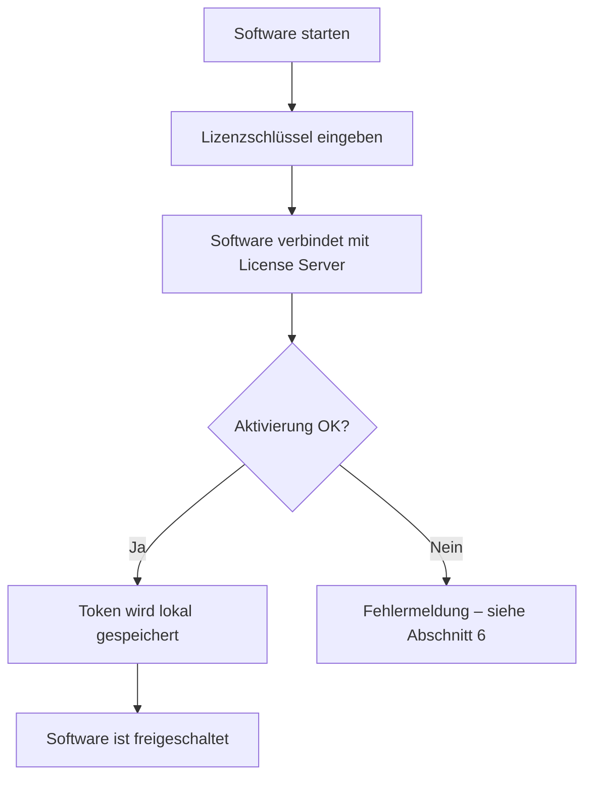

# Anleitung für Software-Nutzer

Diese Anleitung erklärt, wie Sie als **Endanwender** eine Software mit Byte Commander-Lizenzierung aktivieren, nutzen und bei Problemen vorgehen.

Sie benötigen **keinen** Zugang zum Admin-Portal.

---

## 1. Was Sie vom Anbieter erhalten

| Information | Beispiel | Wofür |
|---|---|---|
| **Lizenzschlüssel** | `ABCD-EFGH-IJKL-MNOP` | Einmalige oder erneute Aktivierung |
| **Server-URL** | `<ihre-server-url>` | Verbindung zum Lizenzserver |
| **Software-Installationspaket** | Installer / Download-Link | Ihre Anwendung |
| **Optional: Produkt-ID** | `1` | Manche Integrationen benötigen diese |
| **Optional: 2FA-Hinweis** | Google Authenticator | Nur bei Erstaktivierung auf neuem Gerät |

> Bewahren Sie den Lizenzschlüssel wie ein Passwort auf. Teilen Sie ihn nicht öffentlich.

---

## 2. Erstaktivierung (Standard, ohne 2FA)

### Schritte

1. Software installieren und starten.
2. Lizenzschlüssel eingeben (Copy & Paste empfohlen).
3. Auf **Aktivieren** / **Activate** klicken.
4. Bei Erfolg: Software ist freigeschaltet – der Lizenz-Token wird **lokal** gespeichert.

### Was im Hintergrund passiert

- Ihr Gerät erhält eine eindeutige **Geräte-ID** (automatisch).
- Der Server prüft: Schlüssel gültig, nicht abgelaufen, Aktivierungslimit nicht erreicht.
- Ein signierter **Token** wird ausgestellt und auf Ihrem Gerät gespeichert.

---

## 3. Erstaktivierung mit 2FA (Google Authenticator)

Wenn Ihr Anbieter 2FA für das Produkt aktiviert hat, ist beim **ersten Start auf einem neuen Gerät** ein zusätzlicher Sicherheitscode nötig.

> **Wichtig:** 2FA ist **nur bei der Erstaktivierung** erforderlich – nicht bei jedem Programmstart.

### Ablauf

1. Lizenzschlüssel eingeben → **Aktivieren**
2. Software fordert einen **6-stelligen Code** an
3. Code in **Google Authenticator** (oder kompatibler App) öffnen
4. Aktuellen 6-stelligen Code eingeben (wechselt alle ~30 Sekunden)
5. Bestätigen → Aktivierung abgeschlossen

### Hinweise

| Thema | Detail |
|---|---|
| Aktivierungsfenster | Der Zwischenschritt auf dem Server läuft nach **10 Minuten** ab – dann erneut starten |
| TOTP-Code | Nur der **aktuelle** Code ist gültig (~30 Sekunden) |
| Neues Gerät | Erneut 2FA bei Erstaktivierung auf diesem Gerät |
| Gleiches Gerät | Kein erneutes 2FA – gespeicherter Token wird validiert |

---

## 4. Normaler Programmstart (nach Aktivierung)

Bei jedem Start prüft die Software den gespeicherten Token:

1. **Online-Validierung** (Standard): Verbindung zum License Server → sofortige Erkennung widerrufener/abgelaufener Lizenzen
2. **Offline-Validierung** (Fallback): Prüfung des lokalen Tokens ohne Internet (JWT-`exp` / `offlineUntil`, Standard **72 Stunden**)

**Kein Lizenzschlüssel erneut eingeben**, solange:
- der Token gültig ist
- die Lizenz nicht widerrufen wurde
- das Gerät nicht deaktiviert wurde

---

## 5. Lizenz auf einem weiteren Gerät nutzen

Ob das möglich ist, hängt vom Lizenztyp ab:

| Situation | Ergebnis |
|---|---|
| **Max. 1 Gerät** (`node_locked` / Limit 1) | Zweites Gerät blockiert, bis erstes deaktiviert wird |
| **Mehrere Geräte erlaubt** | Schlüssel auf weiterem Gerät erneut aktivieren |
| **2FA aktiv** | Auf jedem **neuen** Gerät erneut 2FA bei Erstaktivierung |

Gerät wechseln (bei Limit 1):

1. Altes Gerät: Software deaktivieren **oder** Support kontaktieren
2. Neues Gerät: Lizenzschlüssel erneut aktivieren

---

## 6. Fehlerbehebung

### „License not found" / „Lizenz nicht gefunden"

- Lizenzschlüssel auf Tippfehler prüfen (Format: `XXXX-XXXX-XXXX-XXXX`)
- Leerzeichen am Anfang/Ende entfernen
- Anbieter kontaktieren, falls Schlüssel korrekt

### „Maximum activations reached" / „Maximale Aktivierungen erreicht"

- Lizenz ist auf allen erlaubten Geräten aktiv
- Ungenutztes Gerät deaktivieren oder Anbieter um Slot-Freigabe bitten

### „License has expired" / „Lizenz abgelaufen"

- Abonnement/Laufzeit endete
- Anbieter um Verlängerung oder neuen Schlüssel bitten

### „License is revoked" / „Lizenz widerrufen"

- Lizenz wurde administrativ gesperrt
- Anbieter kontaktieren

### „2FA required" / „Invalid TOTP code"

- Sicherstellen, dass 2FA für dieses Produkt vorgesehen ist
- Korrekten **aktuellen** 6-stelligen Code verwenden
- Uhrzeit des Geräts prüfen (TOTP ist zeitsensibel)
- Innerhalb von 10 Minuten nach Start der Aktivierung bestätigen

### „Invalid or expired token" beim Start

- Internetverbindung prüfen und Software neu starten
- Falls dauerhaft: Lizenzschlüssel erneut aktivieren
- Token abgelaufen und Offline-Grace überschritten → Online-Verbindung herstellen

### Verbindungsfehler zum Server

- Server-URL vom Anbieter bestätigen lassen
- Firewall/Proxy prüfen (HTTPS zum License Server)
- VPN testweise deaktivieren

---

## 7. Deaktivierung

Falls die Software eine Deaktivierung anbietet:

1. Einstellungen → Lizenz → **Deaktivieren**
2. Lokaler Token wird gelöscht
3. Geräte-Slot auf dem Server wird freigegeben

Ohne Deaktivierung belegt das Gerät weiterhin einen Aktivierungs-Slot.

---

## 8. Datenschutz & Sicherheit

| Thema | Verhalten |
|---|---|
| Gespeicherte Daten | Lizenz-Token lokal auf dem Gerät (Pfad abhängig vom Betriebssystem) |
| Übertragene Daten | Lizenzschlüssel, Geräte-ID, optional Geräteinformationen |
| 2FA | TOTP-Code nur bei Erstaktivierung übertragen |
| Empfehlung | Lizenzschlüssel nicht in E-Mails/Chats veröffentlichen |

---

## 9. Support-Checkliste

Wenn Sie den Support kontaktieren, halten Sie bereit:

- Lizenzschlüssel (letzte 4 Zeichen genügen oft zur Identifikation)
- Produktname / Version der Software
- Betriebssystem
- Fehlermeldung (exakter Wortlaut)
- Zeitpunkt des Fehlers
- Ob neues Gerät oder Gerätewechsel

---

## 10. Für Entwickler Ihrer Software

Technische Integration (SDK, API): [INTEGRATION_GUIDE.md](../INTEGRATION_GUIDE.md)

Administration (Lizenzen ausstellen): [ANLEITUNG_LIZENZADMIN.md](./ANLEITUNG_LIZENZADMIN.md)
